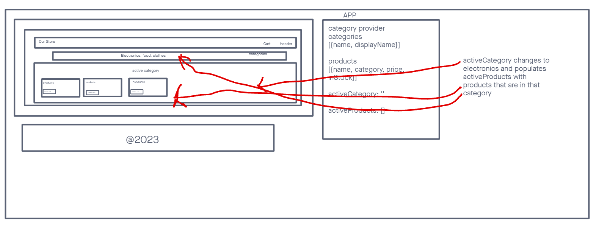
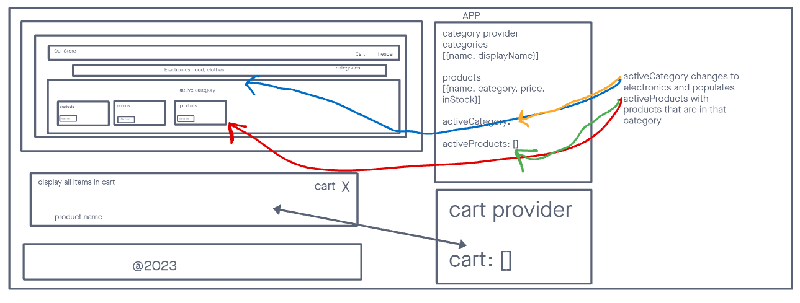
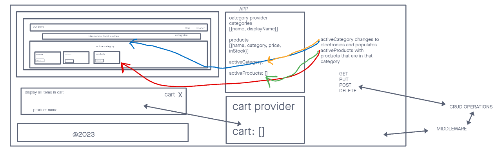

# Virtual Storefront

## Overview

The purview of this React-based application is a virtual storefront, wherein users can peruse and acquire products. The implementation of the application will occur in four stages, with the initial stage focusing on the establishment of the fundamental scaffolding and initial styling of the application. The objective is to create a polished and user-friendly interface for browsing products.

## Installation

Initialize the application using create-react-app
Install Material UI as a dependency.

### Technical Requirements

Utilize a Redux store to manage the state of categories and items in the store
Create a visually alluring site utilizing Material UI
Display a list of categories from state
Identify the selected category and show a list of products associated with the category
Create a polished and user-friendly interface

### Development Stages

Scaffolding and Styling: Establish the fundamental scaffolding and initial styling of the application.
Add to Cart Feature: Incorporate the "Add to Cart" feature to the application, enabling users to select items and have them persist in their "shopping cart" for subsequent purchase.
Live API Integration: Link the Virtual Store to a live API so that data is persistent and able to be separately managed.
Integration of Browser Router to have a different page for the routes

## Links and Resources

Documentation for the application can be found in the README file.
The link for the production deployment, when applicable, will be provided in the "Links and Resources" section.

## day 1

## day2

## day3

